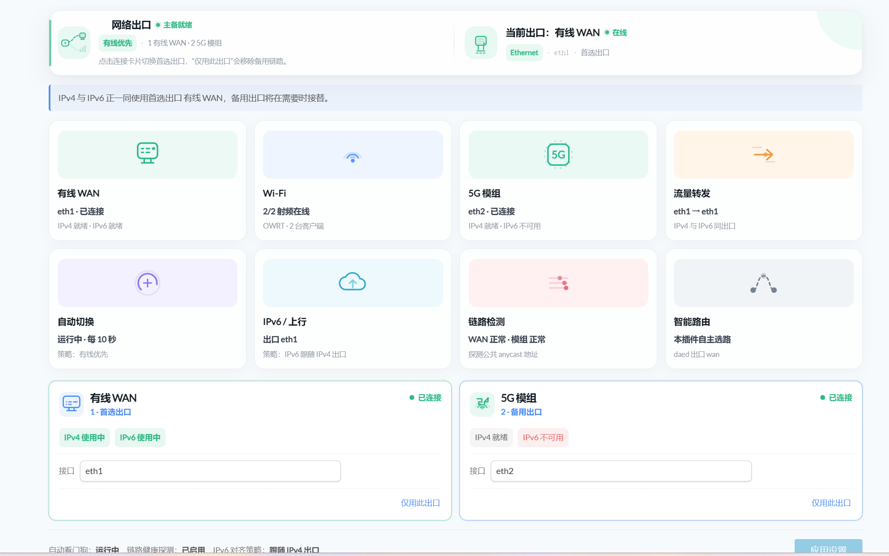
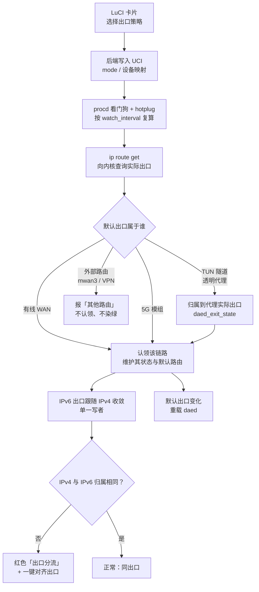

# luci-app-h5000m-netmode

[](https://github.com/LianXia233/luci-app-h5000m-netmode/actions/workflows/ci.yml)
[](https://github.com/LianXia233/luci-app-h5000m-netmode/actions/workflows/release.yml)
[](LICENSE)
[](https://github.com/LianXia233/luci-app-h5000m-netmode/releases)


面向 Hiveton H5000M 的 OpenWrt 出口优先级管理器。通过卡片式 LuCI 界面，一键决定**有线 WAN** 与 **5G 模组**两条链路的启用范围与优先顺序，后端服务自动维护接口状态与默认路由。

- 当前 Release 版本：`v1.6.0`
- 版本格式：`主版本.次版本.修订版本-r打包修订`（GitHub Release 使用语义化标签，OpenWrt 安装包追加打包修订号）

---

## 界面预览

<p align="center">
  
</p>

<p align="center"><sub>H5000M 实机截图：有线 WAN 承载流量、5G 模组待命，<code>split=0</code>，8 个图标全部处于活动态</sub></p>

页面自上而下只读在上、可改在下：

| 区块 | 位置 | 说明 |
| --- | --- | --- |
| **页头合并卡片** | 顶部 | 一张卡片左右两半：左半报**策略**（主备就绪 / 无备用链路 / 单出口运行…）并配一枚按真实出口绘制动效的动态 SVG；右半报**当前出口**的真实网卡名与其在策略中的位置 |
| **提示条** | 卡片下方 | 只在需要动作时出现：分流告警、无默认路由、单出口策略的提醒 |
| **运行状态总览** | 提示条下方 | 8 个动态图标各自绑定一项真实后端字段，静止即表示该路径此刻没有活动 |
| **出口卡片** | 页底 | 两张可编辑卡片：单击设为首选、「仅用此出口」、手动映射物理接口、应用设置 |

---

## 目录

- [界面预览](#界面预览)
- [功能特性](#功能特性)
- [工作原理](#工作原理)
- [快速开始](#快速开始)
- [使用指南](#使用指南)
- [接口映射](#接口映射)
- [配置说明](#配置说明)
- [后端子命令](#后端子命令)
- [目录结构](#目录结构)
- [版本历史](#版本历史)
- [故障排查](#故障排查)
- [常见问题](#常见问题)
- [许可证](#许可证)

---

## 功能特性

| 特性 | 说明 |
| --- | --- |
| 四种出口策略 | `wan_first`（有线优先）/ `modem_first`（5G 优先）/ `wan_only`（仅有线）/ `modem_only`（仅 5G） |
| 卡片式交互 | 单击卡片把该链路设为首选，另一条自动保留为备用；「仅用此出口」是独立控件，避免误点移除备用链路 |
| 双重触发机制 | Hotplug 感知接口 up/down，procd 看门狗按周期重算，覆盖事件丢失与外部改动默认路由的场景 |
| 出口判定基于 FIB | 用 `ip route get` 询问内核实际出口，尊重策略路由（mwan3 / qmodem / VPN / daed） |
| 链路状态分级 | 区分已连接 / 协商中 / 网线未接 / 已断开，网卡载波仅作参考信号 |
| 代理隧道可识别 | 按网卡内核类型（`ARPHRD_NONE` 等）识别 TUN 隧道，并把它归属到代理实际使用的上行链路，而不是当成第三个出口 |
| 分流可观测 | IPv4 与 IPv6 走不同**上行链路**时显式告警，并提供一键「对齐出口」；判定按出口归属而非网卡名比较，带透明代理时不会假报 |
| 运行状态总览 | 页头卡片下方 8 个动态图标各自绑定一项真实后端字段，配色与动画随状态变化；子系统未启用或故障时图标转为灰/红并停止动画 |
| 页头合并卡片 | 一张卡片同时说明**策略**与**当前出口**：左半报策略结论（主备就绪 / 无备用链路 / 单出口运行…）并配一枚按真实出口绘制动效的动态 SVG，右半报承载链路的真实网卡名与策略位置，故障与分流转为红色并停止动画 |
| 链路健康探测 | 默认启用（opt-out），探测公共 anycast 地址以识别「接口已 up 却不通」的假连接；结果仅作诊断，不驱动切换 |
| 无线侧可观测 | 状态总览显示射频在线数、SSID 与关联客户端数，AP 未起来时不再无感 |
| 代理自动联动 | 默认 IPv4 出口变化时自动重新加载 daed，无需手动重新应用代理设置 |
| IPv6 出口约束 | 自动跟随 IPv4 出口，避免 IPv4 走 WAN、IPv6 意外走 5G 的双栈流量分裂 |
| 手动接口映射 | Web 界面下拉框手动指定 WAN / 5G 模组的物理接口，覆盖非标准接口命名场景 |
| 权限分离 | 只读状态查询与策略写入分权，普通监控账号无法改写出口策略 |
| 配置升级保留 | 升级时保留 `/etc/config/h5000m_netmode`，策略不丢失 |
| UCI 持久化 | 所有配置通过 UCI 持久化存储，重启后生效 |
| 隐私安全 | 不依赖云服务，不收集、不上传任何网络数据 |

---

## 工作原理



1. 用户通过 LuCI 卡片选择出口策略，前端**串行**调用后端写入 UCI 配置；
2. 后端根据策略维护 WAN / 5G 接口状态与默认路由（含 IPv6）；
3. 后端用 `ip route get` 向内核查询**实际**默认出口，而不是读取 main 表，因此策略路由（mwan3 / qmodem / VPN / daed）环境下的判定依然准确；若出口是 TUN 隧道（透明代理），则按网卡内核类型识别并归属到代理实际使用的上行链路；
4. IPv6 出口由单一写者收敛：始终跟随现役 IPv4 出口，切换时先拆除旧族默认路由再建立新族；「分流」按两个协议族的**出口归属**比较，而非按网卡名比较，因此在代理承载流量时不会把「IPv4 走 `eth2`、IPv6 走 `singtun0`」误报为分流；
5. 链路状态变化时，Hotplug 脚本（`95-h5000m-netmode`）委托后端对 section 分类并触发重新计算；
6. procd 看门狗（`/etc/init.d/h5000m-netmode`）按 `watch_interval` 周期复算，覆盖 Hotplug 看不到的漂移；
7. 默认出口变化时联动重载 daed，保持代理链路一致；
8. 检测到 IPv4 与 IPv6 出口不一致时自动纠正，并在界面上显式告警；
9. 链路健康探测默认启用（`health_check`，显式设为 `0` 关闭），对公共 anycast 地址探测并缓存结论，出口卡片上方的状态总览直接读取这些实测值而非推断值。

根因级分析、判定逻辑与排查手法见 [FIXES.md](FIXES.md)。

---

## 快速开始

### 编译

```sh
git clone https://github.com/LianXia233/luci-app-h5000m-netmode.git \
  package/luci-app-h5000m-netmode
make menuconfig
# LuCI -> Applications -> luci-app-h5000m-netmode
make package/luci-app-h5000m-netmode/compile V=s
```

> 提示：GitHub Releases 中的软件包由 GitHub Actions 使用官方 OpenWrt SNAPSHOT `mediatek/filogic` SDK 在线构建，附带中文语言包、SDK 构建公钥和 SHA256 校验文件。软件包应安装到 ABI 匹配的近期 SNAPSHOT 固件。

### 安装

```sh
opkg install luci-app-h5000m-netmode_*.ipk
```

安装完成后刷新 LuCI 页面，进入 **移动网络 → 出口优先级** 即可使用。

### 卸载

```sh
opkg remove luci-app-h5000m-netmode
```

---

## 使用指南

### 出口策略

| 策略 | 说明 | 适用场景 |
| --- | --- | --- |
| `wan_first` | 有线 WAN 优先，WAN 不可用时自动切换 5G | 日常办公，追求稳定低延迟 |
| `modem_first` | 5G 优先，5G 不可用时自动切换有线 WAN | 追求移动网络带宽 |
| `wan_only` | 仅使用有线 WAN，禁用 5G 出口 | 有流量配额或安全要求 |
| `modem_only` | 仅使用 5G，禁用有线 WAN 出口 | 有线故障排查或场景隔离 |

### LuCI 界面

打开 **移动网络 → 出口优先级**，页面自上而下依次是：**页头合并卡片** → 提示条 → 一排动态图标（运行状态总览）→ 两张可编辑的出口卡片 → 看门狗状态与操作按钮。只读的读数在上，可改的控件在下。

下方两张卡片：

- **有线 WAN 卡片** / **5G 模组卡片**：显示链路状态、当前角色，以及两个协议族各自的就绪情况
- **单击卡片**：把该链路设为**首选出口**，另一条自动成为**备用出口**。此操作**不会**禁用备用链路
- **仅用此出口**（卡片右下角）：把该链路设为唯一出口，另一条会被移出路由表，故障时不再自动接替。点击后该按钮变为「已是唯一出口」
- **接口下拉框**：手动指定该出口对应的物理设备
- **应用设置**：提交改动。只有在存在未提交改动时按钮才可用
- **对齐出口**：仅在检测到 IPv4 与 IPv6 分流时出现，一键把 IPv6 拉回 IPv4 出口（不改动所选策略）

页头那张合并卡片说明**当前实际承载流量**的那条链路——它的真实网卡名、在策略里的位置，以及链路此刻是否在动；若两个协议族走不同出口，卡片转为红色「出口分流」并在提示条中列出各自的实际出口。合并卡片下方显示自动看门狗与链路健康探测的运行状态。

总览区块本身不设页内标题：每个图标自带名称、数值与说明，再加一层 `<h2>` 只会与「网络出口」标题争夺同一视觉层级。

#### 页头合并卡片

页头是**一张卡片**，左右两半各说一件事，两半使用同一套排版词汇（图标框、标题行、状态胶囊、详情行），因此标题不再是「纯文本旁边放一张卡片」。

**左半：策略**（页面标题所在的一半）

| 位置 | 取值 | 数据来源 |
| --- | --- | --- |
| 标题 | 网络出口 | 固定（页面标题） |
| 图标 | 动态 SVG：左边路由器，右上有线插座、右下蜂窝信号格，两支链路各带一条流动虚线 | 只有承载默认路由的那一支虚线流动，并点亮对应的插座 / 信号格；无出口或外部接管时整幅静止（`active4`、`active6`、`split`） |
| 标题右侧 | 主备就绪 / 无备用链路 / 单出口运行 / 策略被绕过 / 无默认路由 / 分流告警 | 策略顺序与两条链路各自的分级状态、`split`、`active4`、`active6`（分流按出口归属比较，代理隧道归属到其上行链路） |
| 徽标 | 有线优先 / 5G 优先 / 仅有线 / 仅 5G | `mode` |
| 详情 | 策略顺序，如 `1 有线 WAN · 2 5G 模组` | `mode` |
| 底部附注 | 点击连接卡片切换首选出口，「仅用此出口」会移除备用链路（620px 以下隐藏） | 固定说明 |

**右半：当前出口**，五个位置全部取自真实字段，没有一条是固定文案：

| 位置 | 取值 | 数据来源 |
| --- | --- | --- |
| 标题 | 当前出口：有线 WAN / 5G 模组 / 其他路由；或 出口分流 / 无可用出口 | `active4`（为 `none` 时回退到 `active6`）、`split` |
| 标题右侧 | 在线 / 协商中 / 已断开 / 网线未接 / 未配置 / 外部接管 / 告警 / 离线，外加一枚呼吸圆点 | `wan_*` 或 `modem_*` 的分级链路状态、`split`、`daed_exit_state` |
| 徽标 | Ethernet / 5G / LTE / daed 接管 / 外部路由 / 无出口 / `IPv4 <出口>` | 出口类型；分流时改为标出 IPv4 那一侧 |
| 网卡 | 真实设备名（如 `eth1`）；若该出口经透明代理承载则为隧道名（如 `singtun0`） | `wan_device` / `modem_device` / `egress4` |
| 角色 | 首选出口 / 备用出口 · 已接管 / 未纳入策略 / 不在本插件策略内 / 策略：`<策略名>` | `mode` 推出的策略顺序与当前承载链路比对 |

角色这一项刻意区分「备用出口」与「备用出口 · 已接管」：策略首选是 A、实际承载是 B，说明已经发生了故障转移，这正是需要被看见的信息，只写「备用」会把这件事藏起来。

两半的结论刻意不同：左半报策略、右半报链路，两者可以互相矛盾——链路健康但备用已经掉了（左半「无备用链路」）是这套策略会悄悄失去的东西，只报「在线」看不出来。同一张卡片里写两遍「在线」只是同一条信息的副本。因此卡片的整体配色仍只由右半决定：若把策略结论也染到卡片上，「仅用此出口」这种刻意的选择会让整张卡片长期挂在告警色上，而那个颜色从此不再意味着「此刻有问题」——策略的取态由左半那枚胶囊自己说。

两半的图标与总览同源：正常态保留设计稿的基色（有线绿、蜂窝蓝），降级转琥珀，分流与无出口转红或灰并**停止动画**。设计稿是组件展示页，左右两张卡都写「在线」才能把两种配色都展示出来——真机上同一时刻只有一条链路在承载流量，照搬会印出设备不可能处于的状态。

#### 运行状态总览

页头合并卡片下方有 8 个动态图标，每个都绑定一项真实后端字段——图标是读数，不是装饰：

| 图标 | 数据来源 | 正常表现 |
| --- | --- | --- |
| 有线 WAN | `wan_*` 链路状态 + 两个协议族的就绪情况 | 绿色，数据流动画运行 |
| Wi-Fi | `wifi_up` / `wifi_total` / `wifi_ssid` / `wifi_clients` | 蓝色，信号波动画运行 |
| 5G 模组 | `modem_*` 链路状态 + 两个协议族的就绪情况 | 绿色，环形动画运行 |
| 流量转发 | `egress4` / `egress6` / `active4` / `active6` / `split` | 橙色，数据包位移动画运行；同出口判定按归属比较，经代理时显示 `eth2 → singtun0` 并标注「IPv4 与 IPv6 同出口」 |
| 自动切换 | `watcher` / `watch_interval` / `mode` | 紫色，环形进度动画运行 |
| IPv6 / 上行 | `active6` / `egress6` / `split` | 青色，上传动画运行 |
| 链路检测 | `health_check` / `wan_health` / `modem_health` | 红色，扫描动画运行 |
| 智能路由 | `active4` / `daed_exit_state` | 灰色，路径动画运行 |

配色与动画都取自实时状态：降级转琥珀色，故障转红色，未启用或无数据转灰色并**停止动画**——静止即表示该路径当前没有活动，不存在「一直在转但其实什么都没发生」的图标。例如把 `health_check` 设为 `0`，链路检测图标会在下一次轮询内变为灰底、文案变为「未启用」且动画停止。

状态未变化时页面不会重建这些节点，因此 5 秒轮询不会打断动画。

---

## 接口映射

当有线 WAN 口命名非标准（如部分设备将真正的有线口注册为非 `wan` section），或 5G 模组接口名不被自动识别时，可通过每张出口卡片底部的下拉框手动指定物理接口：

| 操作对象 | 说明 |
| --- | --- |
| 有线 WAN 卡片 | 从可用 eth 设备列表中选择有线出口对应的物理口 |
| 5G 模组卡片 | 选择 5G 模组对应的物理口 |

- 选择后点击「应用设置」保存，配置通过 UCI `h5000m_netmode.settings.{wan_device,modem_device}` 持久化；
- 手动映射会**覆盖**自动发现结果；未设置时自动回退到原自动行为。

---

## 配置说明

### 配置文件

- 配置文件：`/etc/config/h5000m_netmode`
- 后端命令：`/usr/sbin/h5000m-netmode`
- LuCI 页面：**移动网络 → 出口优先级**

### UCI 配置项

| 配置项 | 类型 | 说明 |
| --- | --- | --- |
| `h5000m_netmode.settings.mode` | `wan_first` / `modem_first` / `wan_only` / `modem_only` | 出口策略（默认 `wan_first`） |
| `h5000m_netmode.settings.wan_device` | string | 手动指定的有线 WAN 物理接口（可选） |
| `h5000m_netmode.settings.modem_device` | string | 手动指定的 5G 模组物理接口（可选） |
| `h5000m_netmode.settings.watcher` | `0` / `1` | 是否启用 procd 看门狗（默认 `1`） |
| `h5000m_netmode.settings.watch_interval` | 整数（秒） | 看门狗复算周期（默认 `10`） |
| `h5000m_netmode.settings.health_check` | `0` / `1` | 是否启用链路健康探测（默认 `1`，opt-out：显式设为 `0` / `off` / `false` / `no` 才关闭；仅作诊断，不驱动切换） |
| `h5000m_netmode.settings.health_probe_interval` | 整数（秒） | 两次健康探测的最小间隔（默认 `60`；设为 `0` 表示不节流，每次复算都探测） |
| `h5000m_netmode.settings.ipv6_owner` | `wan` / `modem` / `off` / `keep` | IPv6 出口归属，由后端自动维护，通常无需手工设置 |

配置示例：

```uci
config settings 'settings'
	option mode 'wan_first'
	option wan_device 'eth1'
	option modem_device 'eth2'
	option watcher '1'
	option watch_interval '10'
	option health_check '1'
	option health_probe_interval '60'
```

---

## 后端子命令

| 子命令 | 说明 |
| --- | --- |
| `status` | 输出当前状态的完整键值对（只读，不写日志） |
| `apply` / 无参数 | 应用当前策略并重新对齐 IPv6 出口 |
| `set {wan_first\|modem_first\|wan_only\|modem_only}` | 设置出口策略并使其生效 |
| `reconcile` | 只做状态对齐（IPv4/IPv6 同出口），不改动所选策略 |
| `watch` | 以固定周期循环执行 `reconcile`（由 procd 服务托管） |
| `iface-role <section>` | 输出该 section 的角色：`wan` / `modem` / `other`（供 Hotplug 分类使用） |
| `health` | 立即执行一次链路健康探测并输出结果 |
| `list-devices` | 列出系统可用以太网设备（eth0/eth1/...） |
| `get-device-map` | 查看当前 WAN 与 5G 的物理接口映射 |
| `set-device-map {wan\|modem} <device>` | 设置并持久化物理接口映射 |

速查：

```sh
/usr/sbin/h5000m-netmode status                          # 查看完整状态（排查首选）
/usr/sbin/h5000m-netmode status | grep -E '^(active4|active6|split)='   # 只看同出口不变量
/usr/sbin/h5000m-netmode reconcile                       # 强制对齐 IPv4/IPv6 出口
/usr/sbin/h5000m-netmode iface-role 2_1                  # 查看某 section 的角色
/usr/sbin/h5000m-netmode list-devices                    # 列出可用 eth 设备
/usr/sbin/h5000m-netmode get-device-map                  # 查看当前映射
/usr/sbin/h5000m-netmode set-device-map wan eth1         # 设置有线口
/usr/sbin/h5000m-netmode set-device-map modem eth2       # 设置 5G 口
```

### 服务管理

```sh
/etc/init.d/h5000m-netmode start      # 启动看门狗
/etc/init.d/h5000m-netmode stop       # 停止看门狗
/etc/init.d/h5000m-netmode reload     # 重启看门狗（改了 watch_interval 后使用）
uci set h5000m_netmode.settings.watcher=0 && uci commit h5000m_netmode   # 停用看门狗
```

---

## 目录结构

```text
.
├── .github/workflows/
│   ├── ci.yml                     # 持续集成
│   └── release.yml                # Release 自动构建
├── htdocs/luci-static/resources/view/h5000m/
│   └── netmode.js                 # LuCI 前端逻辑
├── po/zh_Hans/                    # 简体中文语言包
├── root/etc/
│   ├── config/h5000m_netmode      # UCI 配置文件
│   ├── hotplug.d/iface/95-h5000m-netmode   # 接口事件热插拔脚本
│   ├── init.d/h5000m-netmode      # procd 看门狗服务
│   └── uci-defaults/90-h5000m-netmode      # 首次安装初始化
├── root/usr/
│   ├── sbin/h5000m-netmode        # 后端主程序
│   ├── sbin/h5000m-netmode-status # 状态查询
│   └── share/luci/menu.d/         # LuCI 菜单注册
├── tests/
│   ├── run_tests.sh               # 后端确定性测试（176 项断言，支持按用例名过滤）
│   ├── svg_audit.js               # 前端审计：SVG 平衡 / 关键帧 / 动画绑定 / 选择器作用域 / 字段契约
│   ├── render_live.js             # 把实机 status 输出灌入真实渲染路径，检查各区域是否互相矛盾
│   ├── test_exit_card.js          # 页头合并卡片测试（离机，154 项断言：四分支 + 两半结构）
│   └── mockbin/                   # 纯 shell 依赖替身
├── tools/
│   └── sync_po.py                 # 从视图源码与菜单 JSON 生成 .po；--check 用于 CI 防漂移
├── docs/preview.png               # 界面预览图（仅用于 README，不进入软件包）
├── scripts/build-release.sh       # 发布构建脚本
├── Makefile                       # OpenWrt 构建描述
├── README.md
├── CHANGELOG.md
├── FIXES.md                       # 根因分析与排查手册
└── LICENSE
```

---

## 版本历史

| 版本 | 日期 | 主要更新 |
| --- | --- | --- |
| [v1.6.2](CHANGELOG.md) | 2026-09-20 | 修复 init 脚本缺少执行位导致看门狗服务从未启动（`/etc/rc.d` 有链接、`uci` 开关为开、包为 installed，而进程不存在）；CI 新增脚本执行位断言 |
| [v1.6.1](CHANGELOG.md) | 2026-09-20 | 修复中文环境下页面标题显示英文——语言包被编译器整份丢弃（构建期新增 `tools/check_catalog.py` 存活检查，CI 与发布流程都会跑） |
| [v1.6.0](CHANGELOG.md) | 2026-09-19 | 新增运行状态总览（8 个动态图标绑定真实状态）；页头改为一张合并卡片（左半报策略并配按真实出口绘制动效的动态 SVG，右半报当前出口）；链路健康探测改为默认启用并支持探测节流；新增无线侧运行状态（射频/SSID/客户端数）；修复透明代理隧道被误判为「其他路由」导致的假分流；重建失效的翻译目录并加 CI 同步检查 |
| [v1.5.0](CHANGELOG.md) | 2026-09-14 | 出口判定改用 FIB 查询；IPv6 出口收敛为单一写者；新增 procd 看门狗与分级链路状态；修正单击卡片禁用备用链路的误触发；新增确定性测试套件 |
| [v1.4.0](CHANGELOG.md) | 2026-08-04 | 物理接口手动映射（卡片内嵌下拉框）；新增 `list-devices` / `get-device-map` / `set-device-map` 子命令 |
| v1.3.1 | 2026-08-02 | ETH fallback 接口选择面板；接口发现逻辑重写；新增 `qmodem` 物理兜底 |
| v1.3.0 | 2026-07-30 | 四种出口策略；卡片式 LuCI 界面；IPv6 出口约束；daed 自动重载 |

完整变更明细请查看 [CHANGELOG.md](CHANGELOG.md)。

---

## 故障排查

先跑一遍快速自检；每条的根因、判定逻辑与更完整的排查手法见 [FIXES.md](FIXES.md)。

```sh
# 1. IPv4 与 IPv6 是否走同一出口：split 必须为 0，active4 与 active6 必须相等
/usr/sbin/h5000m-netmode status | grep -E '^(egress4|egress6|active4|active6|split)='

# 2. 内核实际出口（尊重策略路由）；与 egress4/egress6 一致即说明判定正确
#    注意：若经透明代理承载，两条族的默认路由会落在同一个隧道上（如 singtun0），
#    此时网卡名不同但出口归属相同，split 仍应为 0
ip -4 route get 1.1.1.1 | head -1
ip -6 route get 2606:4700:4700::1111 | head -1

# 3. 各出口的协议族就绪情况
/usr/sbin/h5000m-netmode status | grep -E '_ready='

# 4. 看门狗是否在线
pgrep -f 'h5000m-netmode watch' >/dev/null && /usr/sbin/h5000m-netmode status | grep '^watcher='

# 5. 稳定态零扰动：等待一个周期后日志不应新增
logread | grep h5000m-netmode | tail -5
```

| 现象 | 优先检查 |
| --- | --- |
| 界面显示「已断开」但网线已插好 | 该出口的 `_available` / `_pending`；协商期间显示「协商中」属正常 |
| 合并卡片变红并显示「出口分流」 | 先看 `active4` / `active6` 是否真的不同——若二者相同而 `egress4` / `egress6` 是不同网卡名，那是经透明代理承载的正常现象，`split` 应为 0；确为分流时点击「对齐出口」，并检查 `ipv6_owner` / `ipv6_desired` |
| 带 daed / sing-box 时持续报「分流」 | 确认后端版本已含 `is_tunnel_device()`：`grep -c is_tunnel_device /usr/sbin/h5000m-netmode` 应为非 0；再看 `cat /var/run/h5000m-netmode.daed-exit` 是否为 `wan` / `modem` |
| 主链路断开后没有自动切换 | 先确认 init 脚本有执行位：`ls -l /etc/init.d/h5000m-netmode` 应为 `-rwxr-xr-x`（v1.6.2 之前仓库里记的是 `0644`，procd 无法执行它，服务「已启用」却从未启动，且不报错）；再确认 `ubus call service list` 里有该服务、`ps w \| grep '[h]5000m-netmode watch'` 有进程、`status` 的 `watcher=on`，最后看 `logread \| grep h5000m-netmode` |
| 界面状态与命令行输出不一致 | 页面每 5 秒轮询一次；以 `h5000m-netmode status` 的输出为准 |
| 改了下拉框但 5 秒后自己变回去 | 该版本已修复；确认固件中的前端资源已更新 |
| 界面仍有英文（页面标题、菜单项） | 先确认语言包真的带目录：`ls -l /usr/lib/lua/luci/i18n/h5000m-netmode.zh-cn.lmo` 必须存在。文件缺失说明该包由「每条 `msgstr` 都等于 `msgid`」的目录构建——po2lmo 会丢弃所有恒等条目，并在结果为零条目时删掉自己的输出，于是语言包装得上、却一个 `.lmo` 都没有（v1.6.0 即如此；v1.6.1 起构建前由 `python3 tools/check_catalog.py` 拦住）。文件存在则检查该 `title` 是否有非恒等译文 |

---

## 常见问题

**Q：单击出口卡片会不会把另一条链路禁用掉？**
不会。单击是把该链路设为**首选出口**，另一条自动保留为**备用出口**。只有点击卡片右下角的「仅用此出口」才会把另一条移出路由表。

**Q：下拉框里看不到我想要的物理接口？**
先通过 `h5000m-netmode list-devices` 确认接口是否被系统识别；若接口存在但仍未出现在下拉框中，请确认固件与软件包 ABI 匹配。

**Q：手动设置的接口映射会被自动发现覆盖吗？**
不会。手动映射优先级高于自动发现，且通过 UCI 持久化；只有未设置手动映射时才回退到自动行为。

**Q：升级软件包后策略会丢失吗？**
不会。升级流程会保留 `/etc/config/h5000m_netmode`，策略与手动映射均会保留。

**Q：5G 模组状态显示异常（modem_present=0）？**
旧版本存在非标准模组 section 名（如 `2_1`）导致识别失败的问题，v1.3.1 起已修复，请升级到最新版本；如仍异常，可通过手动接口映射指定模组物理口。

**Q：IPv6 流量会走错出口吗？**
不会。后端自动约束 IPv6 出口跟随现役 IPv4 出口；若因外部操作出现不一致，会在一秒内纠正并在界面红色告警，同时提供「对齐出口」按钮。

**Q：我开了 daed / sing-box 透明代理，页面显示 IPv4 走 `eth2`、IPv6 走 `singtun0`，这算分流吗？**
不算。`singtun0` 是本地 TUN 隧道而非上行链路，它承载的流量最终仍从代理绑定的那条上行出去。后端按网卡内核类型识别隧道，并把隧道归属到 `daed_exit_state` 记录的上行链路，因此 `active4` 与 `active6` 相同、`split=0`，页面显示「IPv4 与 IPv6 同出口」。只有两个协议族归属到**不同上行链路**时才会报分流。

**Q：为什么「分流」判定不看网卡名？**
因为网卡名相同只在「两个出口都是物理网卡」时才是同一件事的等价描述。一旦中间有隧道、策略路由或代理，网卡名就不再等于上行链路。判定按解析后的出口归属（`active4` / `active6`）进行，语义与「两个协议族走了不同上行」严格对齐。

**Q：界面出现了没翻译的英文？**
v1.6.0 及更早的软件包中 `po/zh_Hans/h5000m-netmode.po` 整份描述的是更早一版界面，与当前页面的字符串零重叠，因此翻译全部失效。该目录已重建，并由 CI 的 `python3 tools/sync_po.py --check` 防止再次漂移。

**Q：看门狗每隔几秒就重算一次，会不会导致网络抖动？**
不会。只有在观测状态偏离期望状态时才会写入。稳定配置下每次复算只做只读查询，不提交 UCI、不重载 netifd，日志也不会新增。若仍希望完全停用，设 `h5000m_netmode.settings.watcher=0` 并重启该服务。

**Q：界面显示「协商中」是什么意思？**
该链路已具备可用配置、正在拨号或等待地址分配（netifd 的 `pending` 状态）。它既不是「已连接」也不是「已断开」——旧版本会把这一阶段误报为「已断开」。

**Q：链路健康探测默认开着，会不会一直发 ICMP？**
不会一直发。探测结论会缓存，`health_probe_interval`（默认 60 秒）之内的复算直接复用缓存值，只有超过间隔才重新探测；页面读的也是缓存值，所以界面保持实时而链路不会被高频探测占用。不需要可设 `h5000m_netmode.settings.health_check=0` 并提交，下次轮询即生效。

**Q：健康探测显示「异常」会不会自动切链路？**
不会。探测结果仅用于展示。蜂窝链路常见「网关不回 ICMP 但业务流量正常」，所以它不参与切换判定，也不会触发故障转移。

**Q：运行状态总览里的图标为什么有的不动？**
静止是结论，不是故障。图标只在对应子系统当前确实有活动时才播放动画；子系统被关闭或无数据时（例如 `health_check=0`、无默认路由）会转为灰底并停止动画。看到静止时先读它旁边的状态文本，那才是原因。

**Q：页头为什么只有一张合并卡片？**
因为同一时刻只有一条链路在承载流量。这张卡片右半说明「当前出口」，不是「所有出口的清单」——两条链路各自的完整状态在下方两张可编辑卡片和 8 个图标里。设计稿中的两张卡片是组件展示页的静态演示，两张同时标「在线」在真机上不可能出现。左半不是装饰性的标题栏：它报的是策略结论（备用链路是否还在），这是标题挪进卡片后顺手补上的一项读数。

**Q：左半的图标上有一条虚线在动，它表示什么？**
表示流量正从那一支出。左边是路由器，右上是网线插座、右下是蜂窝信号格，两支各带一条虚线：只有**承载默认路由**的那一支虚线在流动，对应的插座或信号格同时点亮。两支都不动时不是动画坏了，而是当前默认路由不属于这两条链路（例如被 mwan3 / VPN / daed 接管），此时右半标题会写「其他路由」。

**Q：左半写「无备用链路」但右半写「在线」，哪个对？**
两个都对，而且这正是要同时显示的原因。右半说的是链路：当前这条确实在承载流量。左半说的是策略：本该做备用的那条已经不 up 了，故障转移此刻不存在——「有链路在跑」会让这一点看着一切正常，那才是需要被看见的。

**Q：页头卡片写「备用出口 · 已接管」是什么意思？**
策略首选的那条链路没有在承载流量，实际出口是备用链路——也就是发生了故障转移。只写「备用」会看不出这件事，所以单列出来。

**Q：页头卡片的图标为什么不动了？**
与总览图标同一规则：静止是结论。卡片处于分流、无出口、链路断开或未配置状态时会转为红/灰并停止动画，看到静止时读它旁边的状态文本。

**Q：为什么出口判定不直接读 `ip route show default`？**
因为那只会列出 main 表。当 mwan3、qmodem、VPN 或 daed 创建了策略路由后，真实出口由 `ip rule` 指向其他路由表，main 表里的默认路由并不是内核实际使用的那条。本应用改用 `ip route get` 向内核查询实际出口。

**Q：页面标题（浏览器标签页与页头）显示英文，怎么修？**
标题文案定义在 `root/usr/share/luci/menu.d/luci-app-h5000m-netmode.json` 的 `title` 字段，它写的是英文 msgid，由 LuCI 用 `.lmo` 语言包翻译后显示。所以标题显示英文只有两种可能：设备上没有这个语言包的目录，或该 `title` 没有非恒等译文。前者容易被忽略——「包装上了」不等于「有目录」：`ls -l /usr/lib/lua/luci/i18n/h5000m-netmode.zh-cn.lmo` 不存在就是没有目录，此时 `_()` 只能返回原文，页面其余部分看起来正常只是因为视图源码里写的就是中文。v1.6.0 的实际故障正是如此：目录里 112 条译文每条都等于原文，`po2lmo` 全部丢弃并在零条目时删掉自己的输出，语言包最终只装了 `uci-defaults`。改标题后跑 `python3 tools/sync_po.py` 重新生成目录，`python3 tools/check_catalog.py` 会在构建前确认目录能存活、且每个菜单标题都有译文。

---

## 文档

| 文档 | 内容 |
| --- | --- |
| [README.md](README.md) | 功能、界面字段来源、配置项、子命令、排查与常见问题（本文件） |
| [CHANGELOG.md](CHANGELOG.md) | 按版本列出新增 / 变更 / 修复 / 测试 |
| [FIXES.md](FIXES.md) | 根因级分析：每个缺陷的现象、根因、修复、验证手法（含可复跑的断言） |

---

## 许可证

本项目采用 [Apache License 2.0](LICENSE)。
