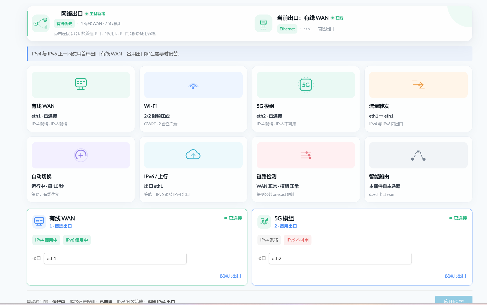
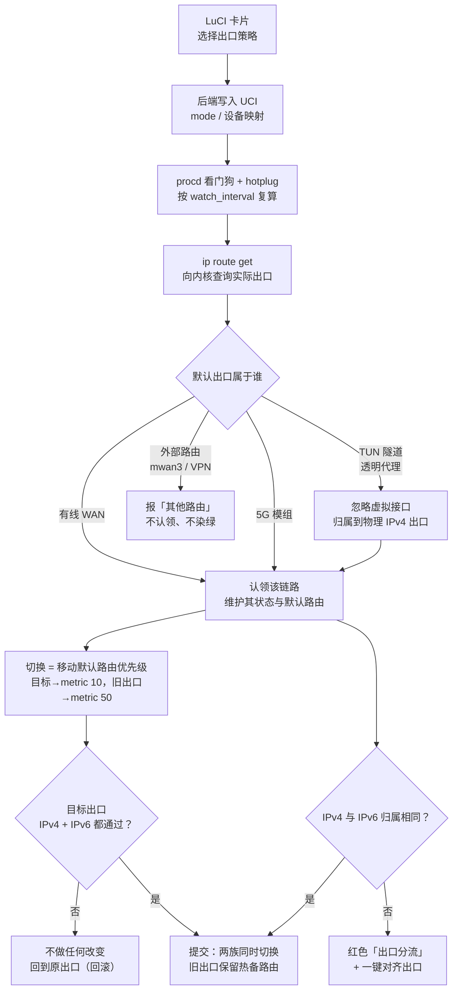
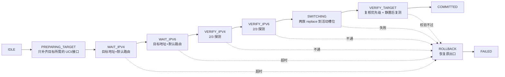

# luci-app-h5000m-netmode

[](https://github.com/LianXia233/luci-app-h5000m-netmode/actions/workflows/ci.yml)
[](https://github.com/LianXia233/luci-app-h5000m-netmode/actions/workflows/release.yml)
[](LICENSE)
[](https://github.com/LianXia233/luci-app-h5000m-netmode/releases)


面向 Hiveton H5000M 的 OpenWrt 出口优先级管理器。通过卡片式 LuCI 界面，一键决定**有线 WAN** 与 **5G 模组**两条链路的启用范围与优先顺序，后端服务自动维护接口状态与默认路由。

- 当前 Release 版本：`v1.8.5`
- 版本格式：`主版本.次版本.修订版本-r打包修订`（GitHub Release 使用语义化标签，OpenWrt 安装包追加打包修订号）

---

## 界面预览

<p align="center">
  
</p>

<p align="center"><sub>H5000M 实机截图：有线 WAN 承载流量、5G 模组待命，<code>split=0</code>，8 个图标全部处于活动态</sub></p>

页面自上而下：**页头合并卡片**（左半报策略、右半报当前出口）→ 提示条 → **运行状态总览**（8 个动态图标，各绑定一项真实后端字段）→ 两张可编辑的**出口卡片**。只读的读数在上，可改的控件在下。

---

## 目录

- [功能特性](#功能特性)
- [工作原理](#工作原理)
- [快速开始](#快速开始)
- [使用指南](#使用指南)
- [接口映射](#接口映射)
- [配置说明](#配置说明)
- [后端子命令](#后端子命令)
- [目录结构](#目录结构)
- [故障排查](#故障排查)
- [常见问题](#常见问题)
- [许可证](#许可证)

---

## 功能特性

| 特性 | 说明 |
| --- | --- |
| 四种出口策略 | `wan_first`（有线优先）/ `modem_first`（5G 优先）/ `wan_only`（仅有线）/ `modem_only`（仅 5G） |
| 卡片式交互 | 单击卡片把该链路设为首选，另一条自动保留为备用；「仅用此出口」是独立控件，避免误点移除备用链路 |
| 双重触发机制 | Hotplug 感知接口 up/down，procd 看门狗按周期重算，覆盖事件丢失与外部改动默认路由的场景 |
| 出口判定基于 FIB | 用 `ip route get` 询问内核实际出口，尊重策略路由（mwan3 / qmodem / VPN / daed） |
| 代理隧道可识别 | 按网卡内核类型识别 TUN 隧道，归属到代理实际使用的上行链路，不作为第三个出口管理 |
| 双栈同出口 | IPv4 / IPv6 以出口组为单位同步切换；分流按出口归属而非网卡名判定，带透明代理不假报，支持一键对齐 |
| 链路状态分级 | 区分已连接 / 协商中 / 网线未接 / 已断开；健康探测（默认启用，opt-out）识别「接口已 up 却不通」的假连接 |
| 切换安全 | 后台任务 + 状态机：失败必回滚、全部等待有上限、切换串行化、冷却抑制环路 |
| 无线侧可观测 | 状态总览显示射频在线数、SSID 与关联客户端数 |
| 手动接口映射 | 界面下拉框手动指定 WAN / 5G 模组的物理接口，覆盖非标准接口命名场景 |
| 配置持久化 | 全部配置经 UCI 持久化，升级保留 `/etc/config/h5000m_netmode`；不依赖云服务，不上传任何网络数据 |

---

## 工作原理


```mermaid
flowchart TD
    A["LuCI 卡片<br/>选择出口策略"] --> B["后端写入 UCI<br/>mode / 设备映射"]
    B --> C["procd 看门狗 + hotplug<br/>按 watch_interval 复算"]
    C --> D["ip route get<br/>向内核查询实际出口"]
    D --> E{"默认出口属于谁"}
    E -->|"有线 WAN"| F["认领该链路<br/>维护其状态与默认路由"]
    E -->|"5G 模组"| F
    E -->|"TUN 隧道<br/>透明代理"| M["忽略虚拟接口<br/>归属到物理 IPv4 出口"]
    M --> F
    E -->|"外部路由<br/>mwan3 / VPN"| G["报「其他路由」<br/>不认领、不染绿"]
    F --> H["切换 = 移动默认路由优先级<br/>目标→metric 10，旧出口→metric 50"]
    H --> P{"目标出口<br/>IPv4 + IPv6 都通过？"}
    P -->|否| Q["不做任何改变<br/>回到原出口（回滚）"]
    P -->|是| K["提交：两族同时切换<br/>旧出口保留热备路由"]
    F --> I{"IPv4 与 IPv6 归属相同？"}
    I -->|否| J["红色「出口分流」<br/>+ 一键对齐出口"]
    I -->|是| K
```

1. 用户通过 LuCI 卡片选择策略，前端调用 `set <mode>`；后端只创建后台任务并**立即返回**，真正的切换由工作进程完成，LuCI 通过只读 `status` 轮询进度（切换中收紧到 1 秒），HTTP/ubus 调用永远不会被切换阻塞；
2. 切换不是重建接口，而是**移动默认路由的优先级**：目标出口被 `ip route replace` 原子提升到活动槽位（metric 10），旧出口降到热备槽位（metric 50）；IPv4 与 IPv6 被建模为两个「出口组」（WAN 组 = `wan` + `wan6`，5G 组 = `modem` + `modem6`），以组为单位同步移动，不存在「IPv4 在新出口、IPv6 在旧出口」的中间态；
3. 出口判定用 `ip route get` 向内核查询**实际**默认出口而非读 main 表，因此策略路由（mwan3 / qmodem / VPN / daed）环境下依然准确；若出口是 TUN 隧道（透明代理），按网卡内核类型识别并归属到代理实际使用的上行链路；
4. Hotplug 脚本（`95-h5000m-netmode`）委托后端对 section 分类并触发复算；procd 看门狗按 `watch_interval` 周期复算，覆盖 Hotplug 看不到的漂移；两路都只管理物理 WAN / 5G 模组接口，HomeProxy、sing-box、daed 等透明代理的 TUN 不作为出口被管理，也不重载代理服务；
5. 检测到 IPv4 与 IPv6 出口不一致时自动纠正（对齐到策略首选出口）并红色告警；若两个族都可用但其中一个**没有出口**，则如实上报而不删除另一个族的默认路由；
6. 链路健康探测默认启用（`health_check=0` 关闭）：对公共 anycast 地址探测并缓存结论，用于**判定出口是否降级**（连续 `probe_fail_streak` 轮失败才动作），并在备用出口完整可达时整体切换；DNS 探测（`dns_check`）只上报，永不参与切换判定。

### 出口切换流程与状态机


```mermaid
flowchart LR
    A["IDLE"] --> B["PREPARING_TARGET<br/>只补齐目标所需的 UCI/接口"] --> C["WAIT_IPV4<br/>目标地址+默认路由"] --> D["WAIT_IPV6<br/>目标地址+默认路由"]
    D --> E["VERIFY_IPV4<br/>2/3 探测"] --> F["VERIFY_IPV6<br/>2/3 探测"] --> G["SWITCHING<br/>两族 replace 到活动槽位"]
    G --> H["VERIFY_TARGET<br/>复核优先级 + 静置后复测"] --> I["COMMITTED"]
    G -.失败.-> J["ROLLBACK<br/>恢复原出口"] --> K["FAILED"]
    C -.超时.-> J
    D -.超时.-> J
    E -.不通.-> J
    F -.不通.-> J
    H -.校验不过.-> J
```

保证与边界：

- **旧出口始终可用**：目标出口的 IPv4 与 IPv6 都通过验证、且默认路由原子替换成功之前，旧出口的默认路由不会被删除或降级为不可用——切换过程不存在「两个出口同时不可用」的窗口；
- **提交前不动路由**：等待或探测阶段失败时不对活动槽位做任何写操作，失败路径不制造抖动；
- **失败必回滚**：提交阶段的任何失败（含 IPv6 提交失败）都会把两个族恢复到切换前的出口；回滚永不产生黑洞路由；
- **全部等待有上限**：等 IPv4 / IPv6、每次探测、以及整次切换（`switch_budget`）都有硬上限，超时按序退出并保留可用出口；
- **切换串行化 + 去抖**：所有写操作共用一把锁，`reconcile` 让路、重复点击排队给正在运行的 worker；Hotplug 事件合并去抖；出口降级需连续多轮探测失败、回切需连续多轮确认、自动动作之间还有冷却时间，不会来回抖。

根因级分析、判定逻辑与排查手法见 [FIXES.md](FIXES.md)。

---

## 快速开始

### 编译

```sh
git clone https://github.com/LianXia233/luci-app-h5000m-netmode.git \
  package/luci-app-h5000m-netmode
make menuconfig
# LuCI -> Applications -> luci-app-h5000m-netmode
make package/luci-app-h5000m-netmode/compile V=s
```

### 后端（Rust）

后端是 Rust crate，构建产物为 aarch64 musl 静态 ELF，随包安装到 `root/usr/sbin`：

```sh
# 交叉编译并用产物覆盖 root/usr/sbin（发布构建会自动执行这一步）
scripts/build-rust.sh aarch64-unknown-linux-musl

# 只编译、只跑测试
cargo test
cargo clippy --all-targets -- -D warnings
```

`root/usr/sbin/h5000m-netmode*` 是提交进仓库的预编译产物（buildroot 没有 Rust 工具链）。CI 会比对编译输出与该产物：不一致时给出警告，并在 main 分支上自动提交更新后的产物并顺带修正格式（`autofix` 任务）。本地改动 `src/` 后执行上面的脚本并连同产物一起提交。

> 提示：GitHub Releases 中的软件包由 GitHub Actions 使用官方 OpenWrt SNAPSHOT `mediatek/filogic` SDK 在线构建，附带中文语言包、SDK 构建公钥和 SHA256 校验文件。软件包应安装到 ABI 匹配的近期 SNAPSHOT 固件。

### 安装

```sh
opkg install luci-app-h5000m-netmode_*.ipk
```

安装完成后刷新 LuCI 页面，进入 **移动网络 → 出口优先级** 即可使用。

### 卸载

```sh
opkg remove luci-app-h5000m-netmode
```

---

## 使用指南

### 出口策略

| 策略 | 说明 | 适用场景 |
| --- | --- | --- |
| `wan_first` | 有线 WAN 优先，WAN 不可用时自动切换 5G | 日常办公，追求稳定低延迟 |
| `modem_first` | 5G 优先，5G 不可用时自动切换有线 WAN | 追求移动网络带宽 |
| `wan_only` | 仅使用有线 WAN，禁用 5G 出口 | 有流量配额或安全要求 |
| `modem_only` | 仅使用 5G，禁用有线 WAN 出口 | 有线故障排查或场景隔离 |

### LuCI 界面

打开 **移动网络 → 出口优先级**，两张出口卡片：

- **单击卡片**：把该链路设为**首选出口**，另一条自动成为**备用出口**，不会禁用备用链路
- **仅用此出口**（卡片右下角）：把该链路设为唯一出口，另一条被移出路由表，故障时不再自动接替
- **接口下拉框**：手动指定该出口对应的物理设备
- **应用设置**：提交改动，只有在存在未提交改动时按钮才可用
- **对齐出口**：仅在检测到 IPv4 与 IPv6 分流时出现，一键把 IPv6 拉回 IPv4 出口（不改动所选策略）

页头合并卡片左半报**策略**（主备就绪 / 无备用链路 / 单出口运行 / 策略被绕过 / 无默认路由 / 分流告警），并配一枚按真实出口绘制动效的动态 SVG——只有承载默认路由的那支虚线在流动；右半报**当前出口**的真实网卡名、协议族与策略位置。卡片配色只由右半（当前出口）决定：降级转琥珀，分流与无出口转红；图标静止即表示该路径此刻没有活动，看到静止时读它旁边的状态文本。

### 运行状态总览

页头卡片下方 8 个动态图标，各绑定一项真实后端字段：

| 图标 | 数据来源 |
| --- | --- |
| 有线 WAN / 5G 模组 | `wan_*` / `modem_*` 链路状态 + 两个协议族的就绪情况 |
| Wi-Fi | `wifi_up` / `wifi_total` / `wifi_ssid` / `wifi_clients` |
| 流量转发 | `egress4` / `egress6` / `active4` / `active6` / `split` |
| 自动切换 | `watcher` / `watch_interval` / `mode` |
| IPv6 / 上行 | `active6` / `egress6` / `split` |
| 链路检测 | `health_check` / `wan_health` / `modem_health` |
| 智能路由 | `active4` / `active6` |

配色与动画取自实时状态：降级转琥珀色，故障转红色，未启用或无数据转灰色并**停止动画**。状态未变化时页面不重建节点，5 秒轮询不会打断动画。

---

## 接口映射

当有线 WAN 口命名非标准（如部分设备将真正的有线口注册为非 `wan` section），或 5G 模组接口名不被自动识别时，可通过每张出口卡片底部的下拉框手动指定物理接口：有线 WAN 卡片选择有线出口对应的物理口，5G 模组卡片选择模组对应的物理口。

- 选择后点击「应用设置」保存，配置通过 UCI `h5000m_netmode.settings.{wan_device,modem_device}` 持久化；
- 手动映射会**覆盖**自动发现结果；未设置时自动回退到原自动行为。

---

## 配置说明

### 配置文件

- 配置文件：`/etc/config/h5000m_netmode`
- 后端命令：`/usr/sbin/h5000m-netmode`
- LuCI 页面：**移动网络 → 出口优先级**

### UCI 配置项

| 配置项 | 类型 | 说明 |
| --- | --- | --- |
| `h5000m_netmode.settings.mode` | `wan_first` / `modem_first` / `wan_only` / `modem_only` | 出口策略（默认 `wan_first`） |
| `h5000m_netmode.settings.wan_device` | string | 手动指定的有线 WAN 物理接口（可选） |
| `h5000m_netmode.settings.modem_device` | string | 手动指定的 5G 模组物理接口（可选） |
| `h5000m_netmode.settings.watcher` | `0` / `1` | 是否启用 procd 看门狗（默认 `1`） |
| `h5000m_netmode.settings.watch_interval` | 整数（秒） | 看门狗复算周期（默认 `10`） |
| `h5000m_netmode.settings.health_check` | `0` / `1` | 是否启用链路健康探测（默认 `1`，opt-out：显式设为 `0` / `off` / `false` / `no` 才关闭；仅作诊断，不驱动切换） |
| `h5000m_netmode.settings.health_probe_interval` | 整数（秒） | 两次健康探测的最小间隔（默认 `60`；设为 `0` 表示不节流，每次复算都探测） |
| `h5000m_netmode.settings.ipv6_owner` | `wan` / `modem` / `split` / `none` | 当前承载 IPv6 的出口（审计字段），由后端自动维护，通常无需手工设置 |
| `h5000m_netmode.settings.strict_dual_stack` | `0` / `1` | **IPv6 门禁（默认 0）**：IPv6 缺失或探测失败一律不阻塞主备切换——没有 IPv6 成员的出口按单栈切换，活动出口缺失的族会停靠备用出口对应路由以阻止分流；设为 `1` 恢复强双栈门禁（有 IPv6 成员的出口必须探测通过才允许提升，否则拒绝切换并回滚） |
| `h5000m_netmode.settings.switch_wait_ipv4` | 整数（秒，≥1） | 切换时等待目标出口 IPv4 结构就绪的上限（默认 `15`） |
| `h5000m_netmode.settings.switch_wait_ipv6` | 整数（秒，≥1） | 切换时等待目标出口 IPv6 结构就绪的上限（默认 `20`） |
| `h5000m_netmode.settings.switch_budget` | 整数（秒，≥5） | 单次切换的总预算（默认 `60`）；预算耗尽即回滚，不会无限等待 |
| `h5000m_netmode.settings.switch_settle` | 整数（秒，≥0） | 提交后复核前的静置窗口（默认 `1`），用于等 netifd 可能的重新宣告 |
| `h5000m_netmode.settings.switch_settle_warm` | 整数（秒，≥0） | 目标出口本来就完整在线时的静置窗口（默认 `0`，即「快速切换」：两次原子 replace 后立即复核） |
| `h5000m_netmode.settings.probe_attempts` | 整数（≥1） | 一次连通性判定最多探测几次（默认 `3`） |
| `h5000m_netmode.settings.probe_ok` | 整数（≥1） | 判定「可达」需要的成功次数（默认 `2`，即 2/3；不会超过总尝试次数） |
| `h5000m_netmode.settings.probe_timeout` | 整数（秒，≥1） | 单次 ping 的超时（默认 `2`） |
| `h5000m_netmode.settings.probe_fail_streak` | 整数（≥1） | 连续多少轮探测失败才判定出口降级并切换（默认 `3`） |
| `h5000m_netmode.settings.switch_cooldown` | 整数（秒，≥0） | 两次自动切换/对齐之间的最小间隔（默认 `20`），用于抑制环路 |
| `h5000m_netmode.settings.align_confirm` | 整数（≥1） | 回切首选出口前需要的连续确认轮数（默认 `2`） |
| `h5000m_netmode.settings.hotplug_debounce` | 整数（秒，≥0） | Hotplug 事件合并窗口（默认 `2`），突发事件只触发一次复算 |
| `h5000m_netmode.settings.reconcile_wait` | 整数（秒） | `reconcile` 等待写锁的上限（默认 `5`） |
| `h5000m_netmode.settings.gw_required` | `0` / `1` | 是否要求目标出口的 IPv4 网关可达（默认 `0`：蜂窝网关常常不回 ICMP） |
| `h5000m_netmode.settings.dns_check` | `0` / `1` | 是否在健康轮次里顺带探测 DNS（默认 `0`）。DNS 只作为状态上报，**永远不参与切换判定** |
| `h5000m_netmode.settings.probe_targets` / `probe_targets6` | 地址列表 | 自定义连通性探测目标（默认 `223.5.5.5 119.29.29.29` / `2400:3200::1 2402:4e00::`，均为国内公共解析） |

配置示例：

```uci
config settings 'settings'
	option mode 'wan_first'
	option wan_device 'eth1'
	option modem_device 'eth2'
	option watcher '1'
	option watch_interval '10'
	option health_check '1'
	option health_probe_interval '60'

	# IPv6 门禁（默认 0）：IPv6 缺失/失败不阻塞切换；设为 1 恢复强双栈门禁
	option strict_dual_stack '0'

	# 切换时间预算：等待就绪、探测次数、失败门限、环路抑制
	option switch_wait_ipv4 '15'
	option switch_wait_ipv6 '20'
	option switch_budget '60'
	option probe_attempts '3'
	option probe_ok '2'
	option probe_fail_streak '3'
	option switch_cooldown '20'
	option hotplug_debounce '2'
```

---

## 后端子命令

| 子命令 | 说明 |
| --- | --- |
| `status` | 输出当前状态的完整键值对（只读，不写日志） |
| `apply` / 无参数 | 应用当前策略并重新对齐 IPv6 出口 |
| `set {wan_first\|modem_first\|wan_only\|modem_only} [--wait]` | 切换出口策略：**立即返回**（后台任务），加 `--wait` 才前台执行 |
| `align [--wait]` | 一键对齐双栈出口（修复 IPv4/IPv6 分流），默认同样立即返回 |
| `notify <section> [action]` | Hotplug 事件入口：合并去抖后触发一次 `reconcile` |
| `reconcile` | 串行化的状态对齐（IPv4/IPv6 同出口、热备路由、孤儿路由回收），不改动所选策略 |
| `eth-candidates` | 列出可作为有线兜底的候选 section |
| `eth-fallback get\|set <sections>` | 查看 / 设置有线兜底 section 列表 |
| `watch` | 以固定周期循环执行 `reconcile`（由 procd 服务托管） |
| `iface-role <section>` | 输出该 section 的角色：`wan` / `modem` / `other`（供 Hotplug 分类使用） |
| `health` | 立即执行一次链路健康探测并输出结果 |
| `list-devices` | 列出系统可用以太网设备（eth0/eth1/...） |
| `get-device-map` | 查看当前 WAN 与 5G 的物理接口映射 |
| `set-device-map {wan\|modem} <device>` | 设置并持久化物理接口映射 |

速查：

```sh
/usr/sbin/h5000m-netmode status                          # 查看完整状态（排查首选）
/usr/sbin/h5000m-netmode status | grep -E '^(active4|active6|split)='   # 只看同出口不变量
/usr/sbin/h5000m-netmode reconcile                       # 强制对齐 IPv4/IPv6 出口
/usr/sbin/h5000m-netmode iface-role 2_1                  # 查看某 section 的角色
/usr/sbin/h5000m-netmode list-devices                    # 列出可用 eth 设备
/usr/sbin/h5000m-netmode get-device-map                  # 查看当前映射
/usr/sbin/h5000m-netmode set-device-map wan eth1         # 设置有线口
/usr/sbin/h5000m-netmode set-device-map modem eth2       # 设置 5G 口
```

### 服务管理

```sh
/etc/init.d/h5000m-netmode start      # 启动看门狗
/etc/init.d/h5000m-netmode stop       # 停止看门狗
/etc/init.d/h5000m-netmode reload     # 重启看门狗（改了 watch_interval 后使用）
uci set h5000m_netmode.settings.watcher=0 && uci commit h5000m_netmode   # 停用看门狗
```

---

## 目录结构

```text
.
├── .github/workflows/
│   ├── ci.yml                     # 持续集成
│   └── release.yml                # Release 自动构建
├── htdocs/luci-static/resources/view/h5000m/
│   └── netmode.js                 # LuCI 前端逻辑
├── po/zh_Hans/                    # 简体中文语言包
├── root/etc/
│   ├── config/h5000m_netmode      # UCI 配置文件
│   ├── hotplug.d/iface/95-h5000m-netmode   # 接口事件热插拔脚本
│   ├── init.d/h5000m-netmode      # procd 看门狗服务
│   └── uci-defaults/90-h5000m-netmode      # 首次安装初始化
├── root/usr/
│   ├── sbin/h5000m-netmode        # 后端主程序（由 src/ 编译而来）
│   ├── sbin/h5000m-netmode-status # 状态查询（由 src/bin 编译而来）
│   └── share/luci/menu.d/         # LuCI 菜单注册
├── src/                           # Rust 后端源码
├── Cargo.toml / Cargo.lock        # Rust 后端构建描述
├── tests/
│   ├── run_tests.sh               # 后端确定性测试（支持按用例名过滤）
│   ├── netlink_netns.py           # 用真实内核（临时 netns）钉住 netlink 报文布局
│   ├── svg_audit.js               # 前端审计：SVG 平衡 / 关键帧 / 动画绑定 / 选择器作用域 / 字段契约
│   ├── render_live.js             # 把实机 status 输出灌入真实渲染路径，检查各区域是否互相矛盾
│   ├── test_exit_card.js          # 页头合并卡片测试（离机：四分支 + 两半结构）
│   └── mockbin/                   # 纯 shell 依赖替身
├── tools/
│   └── sync_po.py                 # 从视图源码与菜单 JSON 生成 .po；--check 用于 CI 防漂移
├── docs/preview.png               # 界面预览图（仅用于 README，不进入软件包）
├── scripts/build-release.sh       # 发布构建脚本
├── scripts/build-rust.sh          # 从 src/ 重建 root/usr/sbin 下的二进制
├── Makefile                       # OpenWrt 构建描述
├── README.md
├── CHANGELOG.md
├── FIXES.md                       # 根因分析与排查手册
└── LICENSE
```

---

## 故障排查

先跑一遍快速自检；每条的根因、判定逻辑与更完整的排查手法见 [FIXES.md](FIXES.md)。

```sh
# 1. IPv4 与 IPv6 是否走同一出口：split 必须为 0，active4 与 active6 必须相等
/usr/sbin/h5000m-netmode status | grep -E '^(egress4|egress6|active4|active6|split)='

# 2. 内核实际出口（尊重策略路由）；与 egress4/egress6 一致即说明判定正确
#    注意一：IPv6 必须带上源地址。不带源的 `ip -6 route get` 会被策略路由抢答——
#    装了透明代理时它会落进代理自己的路由表（如 singtun0），从而把「代理承载」
#    误读成「出口分流」；带源地址的查询才反映设备真实使用的物理出口。
#    注意二：若确实经透明代理承载，两条族的默认路由会落在同一个隧道上（如
#    singtun0），此时网卡名不同但出口归属相同，split 仍应为 0
V6SRC=$(ip -6 addr show dev br-lan | grep -m1 'scope global' | awk '{print $2}' | cut -d/ -f1)
ip -4 route get 223.5.5.5 | head -1
ip -6 route get 2400:3200::1 from "$V6SRC" | head -1

# 3. 各出口的协议族就绪情况
/usr/sbin/h5000m-netmode status | grep -E '_ready='

# 4. 看门狗是否在线
pgrep -f 'h5000m-netmode watch' >/dev/null && /usr/sbin/h5000m-netmode status | grep '^watcher='

# 5. 稳定态零扰动：等待一个周期后日志不应新增
logread | grep h5000m-netmode | tail -5
```

| 现象 | 优先检查 |
| --- | --- |
| 界面显示「已断开」但网线已插好 | 该出口的 `_available` / `_pending`；协商期间显示「协商中」属正常 |
| 合并卡片变红并显示「出口分流」 | 先看 `active4` / `active6` 是否真的不同——若二者相同而 `egress4` / `egress6` 是不同网卡名，那是经透明代理承载的正常现象，`split` 应为 0；确为分流时点击「对齐出口」，并检查 `ipv6_owner` / `ipv6_desired` |
| 带 HomeProxy / sing-box / daed 时持续报「分流」 | v1.6.5 起后端只管理物理 WAN / 5G 模组接口：TUN 会按本轮 IPv4 物理出口归属，不会重载代理服务。先确认后端含 `is_tunnel_device()`（`grep -c is_tunnel_device /usr/sbin/h5000m-netmode` 非 0），再用**带源地址**的查询核对物理出口（见上方自检第 2 条） |
| 主链路断开后没有自动切换 | 先确认 init 脚本有执行位：`ls -l /etc/init.d/h5000m-netmode` 应为 `-rwxr-xr-x`（v1.6.2 之前记的是 `0644`，服务「已启用」却从未启动）；再确认 `ubus call service list` 里有该服务、`ps w \| grep '[h]5000m-netmode watch'` 有进程、`status` 的 `watcher=on`，最后看 `logread \| grep h5000m-netmode` |
| 界面状态与命令行输出不一致 | 页面每 5 秒轮询一次；以 `h5000m-netmode status` 的输出为准 |
| 界面仍有英文（页面标题、菜单项） | 先确认语言包目录存在：`ls -l /usr/lib/lua/luci/i18n/h5000m-netmode.zh-cn.lmo` 必须存在——「包装上了」不等于「有目录」。v1.6.0 的故障是恒等译文被 po2lmo 全部丢弃、语言包最终零条目；v1.6.1 起构建前由 `check_catalog.py` 拦截，详见 FIXES.md |

---

## 常见问题

**Q：单击出口卡片会不会把另一条链路禁用掉？**
不会。单击是把该链路设为**首选出口**，另一条自动保留为**备用出口**。只有点击卡片右下角的「仅用此出口」才会把另一条移出路由表。

**Q：下拉框里看不到我想要的物理接口？**
先通过 `h5000m-netmode list-devices` 确认接口是否被系统识别；若接口存在但仍未出现在下拉框中，请确认固件与软件包 ABI 匹配。

**Q：手动设置的接口映射会被自动发现覆盖吗？**
不会。手动映射优先级高于自动发现，且通过 UCI 持久化；只有未设置手动映射时才回退到自动行为。

**Q：升级软件包后策略会丢失吗？**
不会。升级流程会保留 `/etc/config/h5000m_netmode`，策略与手动映射均会保留。

**Q：我开了 daed / sing-box 透明代理，页面显示 IPv4 走 `eth2`、IPv6 走 `singtun0`，这算分流吗？**
不算。`singtun0` 是本地 TUN 隧道而非上行链路，后端按网卡内核类型识别隧道并归属到同一轮状态里已判定的 IPv4 物理出口，因此 `active4` 与 `active6` 相同、`split=0`。分流判定按解析后的**出口归属**而非网卡名进行——一旦中间有隧道、策略路由或代理，网卡名就不再等于上行链路。

**Q：IPv6 流量会走错出口吗？**
不会。后端自动约束 IPv6 出口跟随现役 IPv4 出口；若因外部操作出现不一致，会在一秒内纠正并红色告警，同时提供「对齐出口」按钮。

**Q：看门狗每隔几秒就重算一次，会不会导致网络抖动？**
不会。只有在观测状态偏离期望状态时才写入。稳定配置下每次复算只做只读查询，不提交 UCI、不重载 netifd，日志也不新增。若希望完全停用，设 `h5000m_netmode.settings.watcher=0` 并重启该服务。

**Q：「协商中」是什么意思？**
该链路已具备可用配置、正在拨号或等待地址分配（netifd 的 `pending` 状态）。它既不是「已连接」也不是「已断开」——旧版本会把这一阶段误报为「已断开」。

**Q：链路健康探测会一直发 ICMP 吗？显示「异常」会自动切链路吗？**
不会一直发：探测结论缓存 `health_probe_interval`（默认 60 秒），页面读的也是缓存值。探测结果仅用于展示与降级判定，蜂窝链路常见的「网关不回 ICMP 但业务流量正常」不会触发误切换；不需要可设 `health_check=0` 关闭。

**Q：界面出现没翻译的英文 / 页面标题显示英文？**
页面标题定义在 `root/usr/share/luci/menu.d/luci-app-h5000m-netmode.json` 的 `title` 字段（英文 msgid），由 `.lmo` 语言包翻译后显示。标题显示英文只有两种可能：设备上没有语言包目录，或该条目没有非恒等译文。改标题后跑 `python3 tools/sync_po.py` 重新生成目录，`check_catalog.py` 会在构建前确认目录能存活。

**Q：5G 模组状态显示异常（modem_present=0）？**
旧版本存在非标准模组 section 名（如 `2_1`）导致识别失败的问题，v1.3.1 起已修复；如仍异常，可通过手动接口映射指定模组物理口。

**Q：为什么出口判定不直接读 `ip route show default`？**
因为那只会列出 main 表。当 mwan3、qmodem、VPN 或 daed 创建了策略路由后，真实出口由 `ip rule` 指向其他路由表。本应用改用 `ip route get` 向内核查询实际出口。

**Q：总览图标为什么有的不动？**
静止是结论，不是故障。图标只在对应子系统当前确实有活动时才播放动画；子系统被关闭或无数据时（例如 `health_check=0`、无默认路由）会转为灰底并停止动画，原因写在它旁边的状态文本里。

---

## 文档

| 文档 | 内容 |
| --- | --- |
| [README.md](README.md) | 功能、配置项、子命令、排查与常见问题（本文件） |
| [CHANGELOG.md](CHANGELOG.md) | 按版本列出新增 / 变更 / 修复 / 测试 |
| [FIXES.md](FIXES.md) | 根因级分析：每个缺陷的现象、根因、修复、验证手法（含可复跑的断言） |

---

## 许可证

本项目采用 [Apache License 2.0](LICENSE)。
